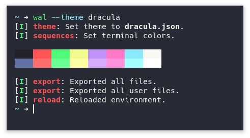

# Dracula for [Pywal](https://github.com/dylanaraps/pywal)

> A dark theme for [Pywal](https://github.com/dylanaraps/pywal).

## Install

All instructions can be found at [draculatheme.com/pywal](https://draculatheme.com/pywal).

## Team

This theme is maintained by the following person(s) and a bunch of [awesome contributors](https://github.com/dracula/pywal/graphs/contributors).

|  |
| ------------------------------------------------------------------------------------------------ |
| [Rex Ng](https://github.com/timescam)                                                            |

## Community

- [Twitter](https://twitter.com/draculatheme) - Best for getting updates about themes and new stuff.
- [GitHub](https://github.com/dracula/dracula-theme/discussions) - Best for asking questions and discussing issues.
- [Discord](https://draculatheme.com/discord-invite) - Best for hanging out with the community.

## License

[MIT License](./LICENSE)
